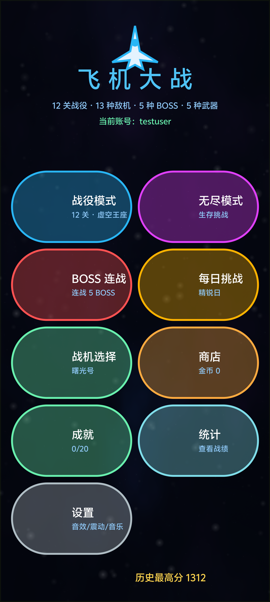
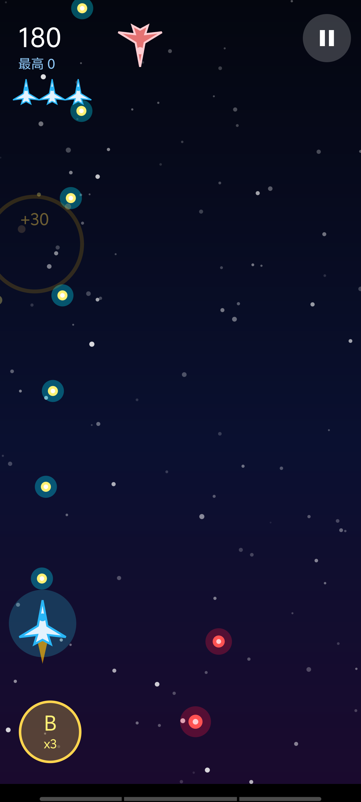
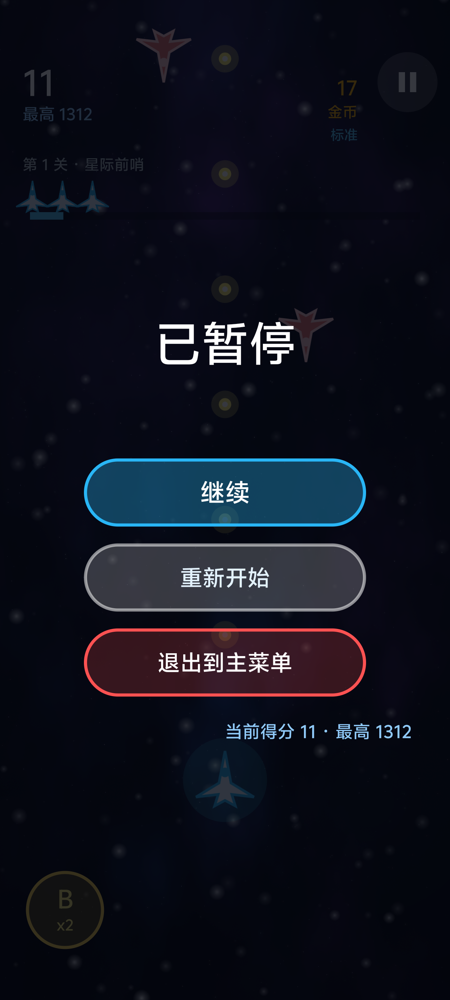
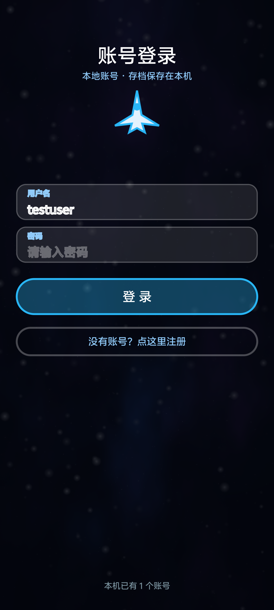

<div align="center">

# 飞机大战 AirForce

一个用 **Kotlin + 原生 Canvas** 手写的 Android 竖版飞机射击游戏。

没有使用任何游戏引擎，所有渲染、物理、碰撞、粒子效果都是逐帧手写。

`12 关战役` · `13 种敌机` · `5 种 BOSS` · `5 种武器` · `6 架战机` · `奖励系统`

</div>

---

## 功能一览

### 战斗玩法
- **12 关战役**：从「星际前哨」到「虚空王座」，每关有独立的敌机权重、血量倍率、刷怪节奏和专属 BOSS
- **4 种模式**：战役 / 无尽 / BOSS 连战 / 每日挑战（每日挑战由日期做种子，全服当天内容一致）
- **13 种敌机**：侦察机、蛇形机、重装机、俯冲机、精英机、绕圈机、分裂机、护盾机、狙击机、自爆机、轰炸机、瞬移机、BOSS
- **5 种武器**：标准炮、激光（穿透）、散射炮、环形炮、追踪弹
- **连击系统**：连击数越高得分倍率越高，最高 3 倍

### 成长系统
- **商店升级**：12 项永久升级（火力、装甲、弹药、护盾、金币雷达、磁力场、机动强化 + 5 种武器解锁 + 复活装置）
- **战机选择**：6 架战机，各有速度 / 射速 / 血量 / 开局火力 / 护盾 / 自动复活的差异
- **僚机与装备**：4 种僚机 + 6 件被动装备（吸血、暴击、再生、贪婪、超载、重力场）

### 奖励系统
- **关卡三星**：★通关 ★无伤 ★得分达标，总星数解锁里程碑奖励
- **星级里程碑**：6 / 12 / 18 / 24 / 30 / 36 星，最高奖励幻影号战机
- **7 天连续签到**：奖励递增，第 7 天额外送秘银钥匙，断签重来
- **每日任务 + 活跃度**：每天按日期种子随机抽 3 个任务，完成后给活跃度，活跃度分 30/60/100 三档领奖
- **开箱抽奖**：金币宝箱 / 秘银宝箱，10 次保底必出大奖，奖品含僚机/装备/战机解锁券

### 账号与存档
- **本地账号系统**：无需联网，用户名 + 密码注册
- **密码安全**：每个账号独立的 16 字节 `SecureRandom` 盐 + 1000 轮 SHA-256 哈希，**明文密码不落盘**
- **多账号存档隔离**：每个账号一个 `save_<id>.xml`，互不干扰
- **老版本进度迁移**：首次注册账号时自动把旧的全局存档搬进新账号
- **存档导入 / 导出**（`SaveTransfer.kt`）：退到后台自动备份到
  `Android/data/com.example.airforce/files/export/`；把 XML 放进
  `.../files/import/` 后重启即可恢复。用的是应用外部文件目录，
  **不需要任何存储权限**，`adb push` / `adb pull` 就能直接搬，
  换手机或换签名重装都能保住进度。

### 伪 3D 渲染
纯 Canvas 2D 引擎，没有引入 OpenGL，立体感全靠四招模拟：
- **透视星空**：星星带深度 `z`，按 `k = 焦距 / z` 投影，朝镜头飞来并拖出拉丝
- **横滚 + 立体投影**：`drawShip3D()` 三层绘制（黑色剪影投影 → 挤出厚度层 → 主体），
  玩家按横向速度压坡度
- **景深雾化**：按屏幕 y 算深度，远处敌机自动缩小、变暗、向背景色混色
  （6 档预生成 `ColorMatrix` 画笔，不每帧新建对象）
- **开箱翻牌**：奖励弹层纵向压扁 `1 → 0 → 1`，半程换面

### 游戏内自动更新
- 启动时静默检查版本清单 → 有新版弹窗提示 → 下载 → 交给系统安装器
- 使用 `PackageInstaller` 会话式安装，无需 FileProvider

---

## 截图

| 主菜单 | 战斗画面 | 暂停菜单 | 本地账号 |
|:---:|:---:|:---:|:---:|
|  |  |  |  |

---

## 技术实现

| 项目 | 说明 |
|---|---|
| 语言 | Kotlin |
| 渲染 | 原生 `Canvas` 2D，手写精灵图生成（`Sprites.kt`） |
| 主循环 | `Choreographer` + 固定步长累加器（1/60 s，最多补 6 步） |
| 对象池 | 子弹 / 粒子 / 敌机 / 道具 / 光环 / 飘字全部走池，避免 GC 抖动 |
| 存档 | `SharedPreferences`（每账号一个文件） |
| 音效 | `SoundPool` 程序化生成音效 + `MediaPlayer` 背景音乐 |
| 输入 | 拖拽跟随 + 软键盘桥接（透明 `EditText` 接管系统输入法） |
| 最低版本 | Android 8.0（API 26） |

### 项目结构

```
AirForce/app/src/main/java/com/example/airforce/
├── GameView.kt        # 主引擎：状态机、渲染、物理、碰撞、UI（约 5000 行）
├── MainActivity.kt    # 宿主 Activity、软键盘桥、自动更新触发
├── GameTypes.kt       # 基础数据类（子弹/敌机/粒子/道具…）
├── Sprites.kt         # 程序化生成所有精灵图（无需美术资源）
├── Levels.kt          # 12 关配置 + BOSS 配置
├── Modes.kt           # 模式常量
├── Upgrades.kt        # 商店升级 + 武器元数据
├── Ships.kt           # 6 架战机配置
├── Equipment.kt       # 僚机 + 装备配置
├── Achievements.kt    # 统计项 + 20 个成就 + 每日挑战
├── Rewards.kt         # 奖励系统：三星/签到/每日任务/开箱
├── AccountStore.kt    # 本地账号（盐 + 哈希）
├── UpdateManager.kt   # 游戏内自动更新
├── SoundManager.kt    # 音效
└── MusicManager.kt    # 背景音乐
```

---

## 编译运行

### 环境要求
- JDK 17
- Android SDK（`compileSdk 37`）
- Gradle 9.x

### 步骤

```bash
# 1. 克隆
git clone <你的仓库地址>
cd AirForce

# 2. 指定 SDK 路径（这个文件不入库，需要自己建）
echo "sdk.dir=/你的/Android/Sdk/路径" > local.properties

# 3. 编译 debug 包
gradle assembleDebug

# 4. 安装到手机
adb install -r app/build/outputs/apk/debug/app-debug.apk
```

产物路径：`app/build/outputs/apk/debug/app-debug.apk`

### 关于正式签名

仓库**不包含**签名密钥（`airforce.keystore`）和密码文件（`keystore.properties`）——这是有意的，签名私钥泄露意味着任何人都能签出冒充你的安装包。

如果你想打正式签名的 release 包，自己生成一套：

```bash
keytool -genkey -v -keystore airforce.keystore -alias airforce \
  -keyalg RSA -keysize 2048 -validity 10000
```

然后在 `AirForce/keystore.properties` 里填：

```properties
storeFile=airforce.keystore
storePassword=你的密码
keyAlias=airforce
keyPassword=你的密码
```

`build.gradle.kts` 会自动读取它。**没有这个文件时 release 会自动退回 debug 签名，依然能编译通过。**

### 关于本机私有配置

`AirForce/local.properties` 同样不入库，里面除了 SDK 路径，还可以配局域网更新地址：

```properties
sdk.dir=C:/你的/Android/Sdk
lanUpdateUrl=http://192.168.1.100:8765
```

`lanUpdateUrl` 会被编译进 `BuildConfig.LAN_UPDATE_URL`，游戏启动检查更新时会优先访问它（局域网比公网快），失败则自动回落到公网更新源。

不配这一行也能正常编译和运行，只是不启用局域网更新。

> 这样设计的原因：内网 IP、主机名这类信息不应该出现在公开仓库里。代码里只保留公网地址，私有地址全部走本地配置文件注入。

---

## 辅助脚本

项目根目录还有几个便利脚本（路径需要按自己的环境改）：

| 文件 | 作用 |
|---|---|
| `一键编译安装.bat` | 编译 debug 包 + 通过 adb 安装到手机 |
| `发布更新.bat` / `发布更新.py` | 编译 + 拷贝 APK 到 `update_site/` + 生成 `version.json` |
| `启动更新服务.bat` / `update_server.py` | 在局域网起一个 HTTP 服务，供游戏内自动更新使用 |

`update_site/` 目录同时也是一个完整的**下载页面**（含安装教程），可以直接部署到任意静态托管。

---

## 说明

本项目为个人学习 Kotlin 与 Android 图形开发的练习作品，仅供学习交流使用。

游戏内所有美术资源均由代码程序化生成，不依赖任何外部图片素材。
